<picture><source media="(prefers-color-scheme: dark)" srcset="assets/dark/header.svg"/></picture>

<a href="https://github.com/RelativelyUnknown/Tree-sitter-sql-polyglot"><picture><source media="(prefers-color-scheme: dark)" srcset="assets/dark/repo-tree-sitter-sql-polyglot.svg"/></picture></a>
<a href="https://github.com/RelativelyUnknown/burnt"><picture><source media="(prefers-color-scheme: dark)" srcset="assets/dark/repo-burnt.svg"/></picture></a>
<a href="https://github.com/RelativelyUnknown/Mallard"><picture><source media="(prefers-color-scheme: dark)" srcset="assets/dark/repo-mallard.svg"/></picture></a>

<picture><source media="(prefers-color-scheme: dark)" srcset="assets/dark/sankey.svg"/></picture>

<picture><source media="(prefers-color-scheme: dark)" srcset="assets/dark/footer.svg"/></picture>
