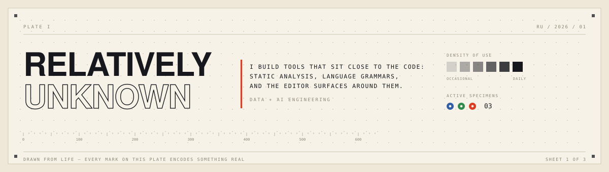
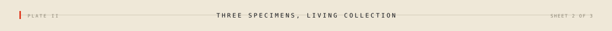
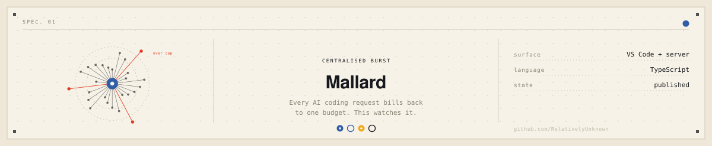
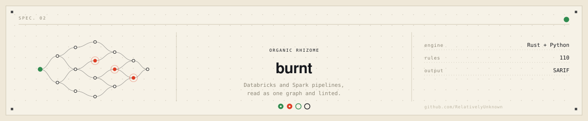
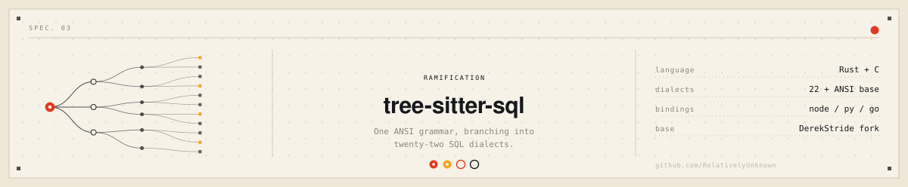
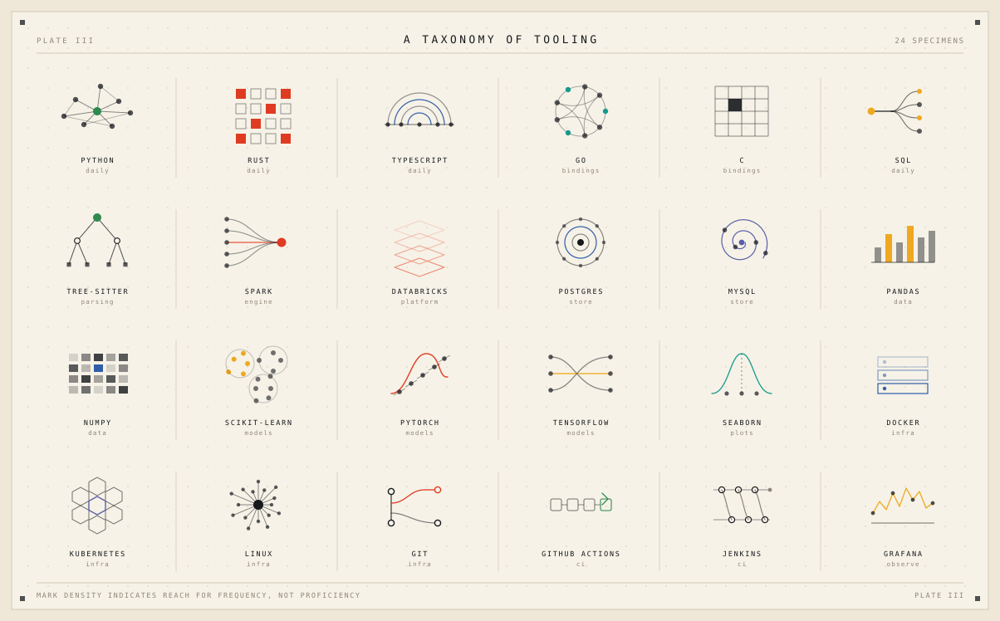
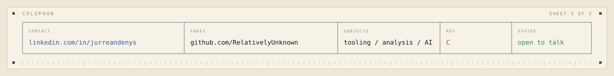

```
   ┌───────────────────────────────────────────────────────┐
   │  DISCIPLINE   data + AI engineering                   │
   │  WORKING ON   static analysis · language grammars     │
   │  REACH FOR    Python · Rust · TypeScript              │
   │  CARE ABOUT   parsers that degrade gracefully         │
   │               tools people keep using after the demo  │
   └───────────────────────────────────────────────────────┘
```



<a href="https://github.com/RelativelyUnknown/Mallard"></a>

<a href="https://github.com/RelativelyUnknown/burnt"></a>

<a href="https://github.com/RelativelyUnknown/tree-sitter-sql-extended"></a>

<p align="right"><sub><a href="https://github.com/RelativelyUnknown?tab=repositories">the rest of the collection →</a></sub></p>



<a href="https://www.linkedin.com/in/jurreandenys/"></a>
