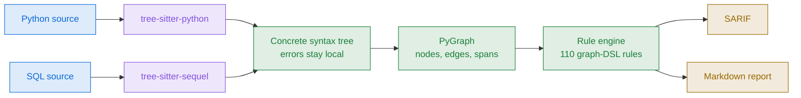

<picture><source media="(prefers-color-scheme: dark)" srcset="assets/dark/header.svg"/></picture>

<a href="https://github.com/RelativelyUnknown/Mallard"><picture><source media="(prefers-color-scheme: dark)" srcset="assets/dark/repo-mallard.svg"/></picture></a>
<a href="https://github.com/RelativelyUnknown/burnt"><picture><source media="(prefers-color-scheme: dark)" srcset="assets/dark/repo-burnt.svg"/></picture></a>
<a href="https://github.com/RelativelyUnknown/tree-sitter-sql-extended"><picture><source media="(prefers-color-scheme: dark)" srcset="assets/dark/repo-grammar.svg"/></picture></a>

<picture><source media="(prefers-color-scheme: dark)" srcset="assets/dark/activity.svg"/></picture>

### How `burnt` reads a pipeline

<picture><source media="(prefers-color-scheme: dark)" srcset="assets/dark/stack.svg"/></picture>

<a href="https://www.linkedin.com/in/jurreandenys/"><picture><source media="(prefers-color-scheme: dark)" srcset="assets/dark/footer.svg"/></picture></a>
