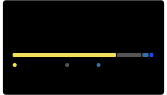
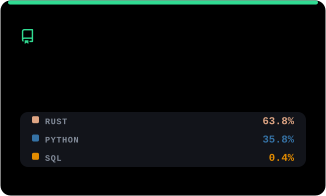
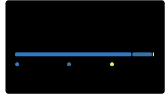

<picture><source media="(prefers-color-scheme: dark)" srcset="assets/dark/header.svg"/></picture>

<picture><source media="(prefers-color-scheme: dark)" srcset="assets/dark/heading-repos.svg"/></picture><a href="https://github.com/RelativelyUnknown/Tree-sitter-sql-polyglot"><picture><source media="(prefers-color-scheme: dark)" srcset="assets/dark/repo-tree-sitter-sql-polyglot.svg"/></picture></a><a href="https://github.com/RelativelyUnknown/burnt"><picture><source media="(prefers-color-scheme: dark)" srcset="assets/dark/repo-burnt.svg"/></picture></a><a href="https://github.com/RelativelyUnknown/Mallard"><picture><source media="(prefers-color-scheme: dark)" srcset="assets/dark/repo-mallard.svg"/></picture></a>

<picture><source media="(prefers-color-scheme: dark)" srcset="assets/dark/sankey.svg"/></picture>

<picture><source media="(prefers-color-scheme: dark)" srcset="assets/dark/lines.svg"/></picture>

<picture><source media="(prefers-color-scheme: dark)" srcset="assets/dark/tools.svg"/></picture>

<picture><source media="(prefers-color-scheme: dark)" srcset="assets/dark/heading-favourites.svg"/></picture><a href="https://github.com/palantir/pyspark-style-guide"><picture><source media="(prefers-color-scheme: dark)" srcset="assets/dark/fav-palantir-pyspark-style-guide.svg"/></picture></a><a href="https://github.com/pydantic/pydantic"><picture><source media="(prefers-color-scheme: dark)" srcset="assets/dark/fav-pydantic-pydantic.svg"/></picture></a>

<a href="https://github.com/DataDog/dd-trace-py"><picture><source media="(prefers-color-scheme: dark)" srcset="assets/dark/fav-datadog-dd-trace-py.svg"/></picture></a><a href="https://github.com/databricks/app-templates"><picture><source media="(prefers-color-scheme: dark)" srcset="assets/dark/fav-databricks-app-templates.svg"/></picture></a>

<a href="https://github.com/bloomberg/memray"><picture><source media="(prefers-color-scheme: dark)" srcset="assets/dark/fav-bloomberg-memray.svg"/></picture></a><a href="https://github.com/pydantic/httpx2"><picture><source media="(prefers-color-scheme: dark)" srcset="assets/dark/fav-pydantic-httpx2.svg"/></picture></a>

<a href="https://github.com/TecharoHQ/anubis"><picture><source media="(prefers-color-scheme: dark)" srcset="assets/dark/fav-techarohq-anubis.svg"/></picture></a>

<picture><source media="(prefers-color-scheme: dark)" srcset="assets/dark/footer.svg"/></picture>
